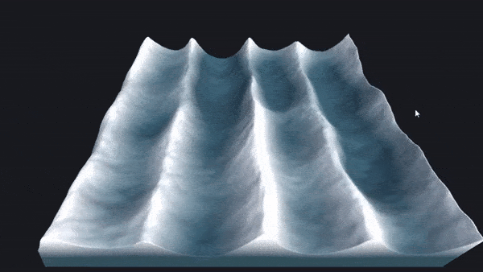

# Interactive-Gerstner-Waves

This is an interactive Gerstner wave doodle using Unity with Burst and the Jobs system. I implemented the waves using the techniquies outlined [here](https://blog.farazshaikh.com/stories/generating-a-stylized-ocean/). And coupled it with a 2D ripple system as explained [here](https://www.youtube.com/watch?v=BZUdGqeOD0w&ab_channel=TheCodingTrain).

This is unlikely to be the best way of doing this, a compute shader implementation would be lightyears faster, however this was a bit of fun and relatively easy to implement on the CPU.
